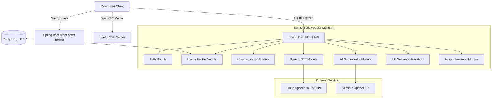

# Accessible Connect - Architectural Specification

This document details the software architecture, modular separations, and technological design patterns for the **Accessible Connect** platform.

---

## 1. High-Level System Architecture

Accessible Connect is designed as a **Modular Monolith**. This pattern combines the deployment simplicity of a single application with the logical isolation and clean boundaries of microservices. If scalability requirements grow, any module can be separated into an independent service with minimal refactoring.



---

## 2. Frontend Architecture (React)

The client application is built as a single-page application (SPA) using React, TypeScript, and Vite.

### Core Architecture Components
1. **Design System & Styling:** Styled with Tailwind CSS v3 using custom CSS variable injections in `styles/index.css`. This enables the entire visual system to dynamically swap values for Light, Dark, and High-Contrast modes.
2. **State & Accessibility Context:** The custom `useAccessibility` React hook and provider control text zoom (`text-large`, `text-xlarge` class triggers) and contrast settings globally, caching preferences in `localStorage`.
3. **Router Routing:** Managed by React Router. In Phase 1, only the `/` page is operational. All other routes are mapped to `PlaceholderPage` components that act as visual package boundaries.
4. **Keyboard Focus Outlines:** A global rule enforces `*:focus-visible` to render a 4px focus indicator in theme-specific contrast colors.

---

## 3. Backend Architecture (Spring Boot)

The backend is built using Spring Boot, Java 21, and Maven. Concerns are split using a strict package-by-feature layout to represent system boundaries.

### Package & Module Definitions
* **`com.accessibleconnect.backend.config`**
  Contains configuration beans for Security filters, CORS mappings, and database DataSource parameters.
* **`com.accessibleconnect.backend.health`**
  Provides static health and diagnostic API endpoints (`GET /api/health`).
* **`com.accessibleconnect.backend.auth` [Planned Phase 2]**
  Manages credentials, password hashing, and stateless JWT generation/validation.
* **`com.accessibleconnect.backend.user` & `com.accessibleconnect.backend.profile` [Planned Phase 2]**
  Stores user records, contacts, and custom accessibility settings.
* **`com.accessibleconnect.backend.communication` [Planned Phase 4]**
  Configures LiveKit token generation, audio/video channels, and WebSocket handlers.
* **`com.accessibleconnect.backend.speech` [Planned Phase 3]**
  Implements the Speech-to-Text adapter layer.
* **`com.accessibleconnect.backend.ai` [Planned Phase 3]**
  Contains translation triggers and LLM orchestration wrappers.
* **`com.accessibleconnect.backend.isl` [Planned Phase 5]**
  Synthesizes speech and text input into ISL meaning and gesture sequences.
* **`com.accessibleconnect.backend.avatar` [Planned Phase 5]**
  Coordinates avatar animations and delivers gesture sequences to the frontend client.
* **`com.accessibleconnect.backend.admin` [Planned Phase 6]**
  Supports user logging, role auditing, and telemetry checks.

---

## 4. Integration Abstractions

To prevent lock-in to specific cloud platforms or hardware, major external service points are isolated using Java interface abstractions.

### A. AI Service Abstraction
No business logic will directly invoke a specific AI client. Instead, modules invoke an `AiService` interface:
```java
public interface AiService {
    String generateResponse(String prompt);
    String translateText(String text, String targetLanguage);
}
```
Specific providers (Gemini, OpenAI, Anthropic) are implemented as classes implementing this interface. They are selected dynamically at boot based on environment variables.

### B. Speech-to-Text (STT) Abstraction
The speech transcription service is isolated via a `SpeechToTextService` interface to allow swaps between cloud APIs (Google Cloud STT, Whisper, Deepgram) and self-hosted libraries:
```java
public interface SpeechToTextService {
    String transcribeAudio(byte[] audioData);
    void startStreamingTranscription(AudioStreamListener listener);
}
```

### C. ISL Pipeline & Avatar Abstraction
The ISL translation pipeline separates linguistic semantics from rendering:
1. **Meaning Parser:** Translates input text into ISL-specific grammatical representation (SVO to SOV order, elimination of passive voice, prepositions, etc.).
2. **Gesture Sequencer:** Converts the grammatical ISL representation into an ordered array of gesture and facial expression tokens.
3. **Avatar Renderer:** Independent of AI logic. Receives the gesture sequence from the sequencer and maps the tokens to keyframe animations on a realistic, human-like avatar.

---

## 5. Database Strategy & Startup Resilience

The platform uses PostgreSQL for persistent user and preference storage.
* **JPA & Hibernate:** Configured in `application.properties` to connect via environment variables (`DATABASE_URL`, `DATABASE_USERNAME`, `DATABASE_PASSWORD`).
* **Startup Resilience:** Hikari connection pool is configured with `initialization-fail-timeout = -1` and Hibernate is set to `ddl-auto = none`. This prevents database connectivity issues from crashing the application context at boot, supporting isolated client development and testing environments.

---

## 6. Scalability Strategy

To scale from MVP to high-volume production:
1. **Stateless APIs:** Except for WebSocket sessions, all HTTP REST controllers are stateless. Client authorization is verified via cryptographic JWTs, allowing backend servers to be load-balanced horizontally.
2. **WebSocket Scaling:** Dynamic WebSocket sessions can be scaled across multiple nodes using an external Redis Pub/Sub backend broker.
3. **Media Streaming Offload:** LiveKit media servers are run as independent SFU (Selective Forwarding Unit) nodes, isolated from Spring Boot server bandwidth.
